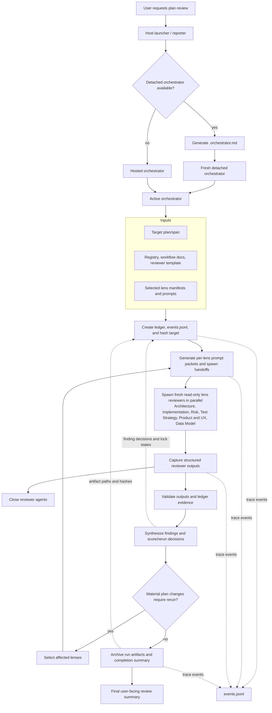

# LensTemper Agent Flow

This diagram shows the high-level data and agent flow for a full LensTemper
review run. A host may either orchestrate the reviewer wave directly or launch a
detached orchestrator with a platform-neutral Markdown packet. The orchestrator
prepares the run, spawns independent read-only lens reviewers, captures their
outputs, validates the evidence, synthesizes findings, and either reruns
affected lenses or archives the completed review.

## Flow Notes

- `*.prompt.md` contains the full reviewer packet for one lens: target text,
  template, lens, constraints, and deterministic revisions.
- `*.spawn.md` is the compact host-to-subagent handoff. It uses
  repository-relative paths and tells the reviewer to read the packet from disk.
- `<pass-id>.orchestrator.md` is the optional detached-orchestrator packet. It
  uses repository-relative paths and describes selected lenses, required
  artifacts, stop conditions, and claim rules.
- `events.jsonl` records trace events for setup, reviewer lifecycle, validation,
  synthesis, reruns, archive, and completion reporting.
- Lens reviewers are independent, read-only, and limited to exactly one lens.
- The active orchestrator, hosted or detached, owns synthesis, ledger state,
  rerun selection, lens locking, archival, and completion claims.
- Reruns should target only lenses affected by material plan changes unless the
  user asks for a full clean rerun or the prior run is stale/corrupted.
- Detached completion claims require agreement among `events.jsonl`, ledger,
  reviewer outputs, synthesis, and archive evidence.
